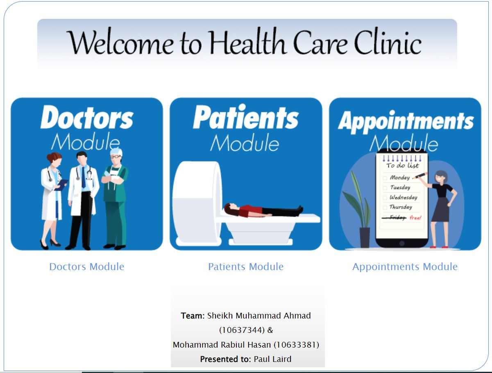
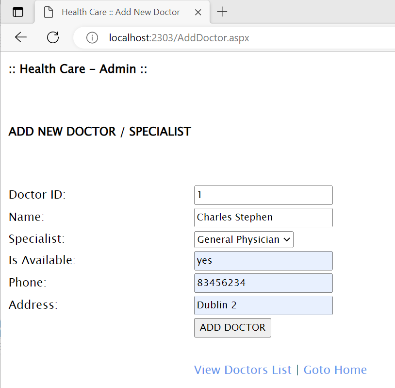
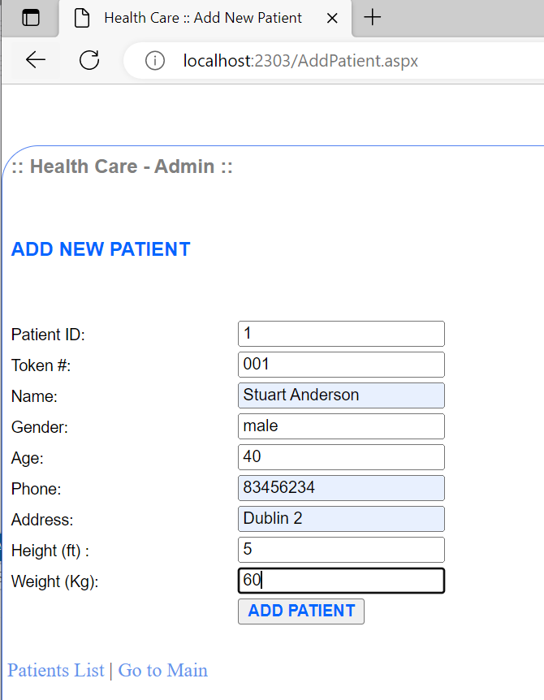
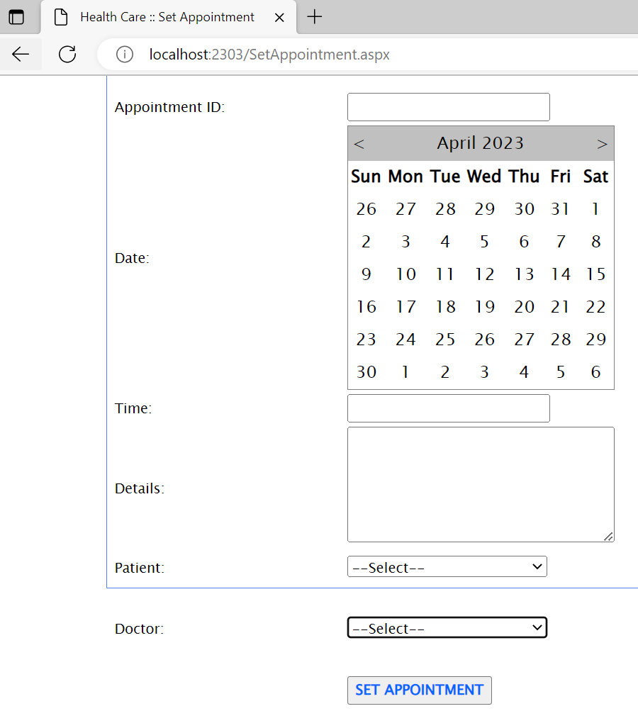

=======================================

Health Care Clinic: A Health Care Clinic Management System

=======================================

In this projent, we are trying to develop a health care management system 
named Health Care Clinic. This type of project is widely used in many 
organization such as diagonostic center, madecal pharmacy and hospitals
for managing the data of doctors, patients and appointment done by 
people. It includes three modules named doctor, patient and appointment 
module.

The modules must be filled by the admin. By doctor module, doctor
adding with ID, name, a list of speciality, phone and address information
should be added to the database. All data input by this module should be
displayed by view doctor list event.

Patient module deals with entering patients data with ID, name, gender,
age, address, phone, height & weight. All submitted data will be shown 
by Patient List tab.

The Appointment module deals with setting apponitment with doctor for
specific patients managed by admin. An appointment ID, date, time and
details must be filled. All appointments data should be shown in 
appointment list tab.

Requirements
============

- Microsoft SQL Server 2019 or later. https://www.microsoft.com/en-ie/sql-server/sql-server-2019
- Microsoft DOT Net and C# framework 4.0 or later. https://dotnet.microsoft.com/en-us/apps/aspnet
- Crystal Report. https://www.sap.com/products/technology-platform/crystal-reports.html

Optional Dependencies
=====================

- Any compatible browser i.e. Chrome, Edge of Mozilla Firefox
- Java Runtime Environment (JRE). https://docs.oracle.com/goldengate/1212/gg-winux/GDRAD/java.htm

Downloading The Solution
======================

The latest stable version of this solution will always be the master
branch of the GitHub repository. You can get the latest version of
the code using the following command:

git clone https://github.com/nayan2eng/HealthCareSystem.git

Quick Start
===========

1. Clone the latest version of the portal from GitHub:

    git clone https://github.com/nayan2eng/HealthCareSystem.git

2. Setup the clone repository in under git tab of Microsoft Visual Studio

3. Execute sync or push/pull

4. Debug and Execute 

5. The output will be shown in a browser (http://localhost:2303/Home.aspx)

Screenshots
=============

Documentation
=============

The framework is documented through doc strings and can be built using dotnet.

The latest generated copy of the documentation can be found at:
http://localhost:2303/en/latest/

Licensing and Copyright
=======================

Copyright (C) 2023 GROUP-I of MS_CYBER_SECURITY_DBS

All Rights Reserved

http://localhost:2303/license/v1.0

Bugs and Support
================

If you think you've found a bug, please report it at:

    https://github.com/nayan2eng/HealthCareSystem/issues

In order to help us solve your issues as quickly as possible,
please include the following information when filing a bug:

* The version of  you're using
* The operating system used to run the portal
* The version of Python used to run the portal
* The suspected operating system of the memory sample
* The complete command line you used to run the portal

For community support, please join us on facebook.

http://localhost:2303/Home.aspx

Contact
=======

For information or requests, contact:

Health Care Clinic Management System

Web: http://localhost:2303/Home.aspx

Email: nayan2eng (at) gmail (dot) com

Email: Sheikh-Sahab (at) gmail (dot) com
